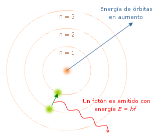

## Concepto, efectos e importancia de la electricidad.

Año 2000 A.C. Magnesia, Grecia.

- Se descubren las propiedades magnéticas de la __magnetita__.

Año 600 A.C. Mileto.

- Frotar ámbar con seda o vidrio con lana. Concepto de _electro_.

Siglo I. China.

- Se inventa la brújula.

Siglo X. España.

Alhazén y Kamal Farisi proponen que los colores visibles son el reflejo de la luz blanca sobre los cuerpos.

1600. Gran Bretaña.

- William Gilbert realiza un estudio detallado de los fenómenos magnéticos y lo publica como _De Magnete_.

1672. Alemania.

- Otto von Guericke construye un generador electrostático con una esfera de azufre y una manivela, generando la carga con la mano.

Siglo XVIII. Italia.

- Se conocen dos tipos de electricidad: la __atmosférica__ (descargas de los rayos) y la __artificial__ (mediante frotación). 

- Máquinas electrostáticas y __Botellas de Layden__.

1707. Inglaterra.

- Francis Hauksbee generó por ionización electrostática del vapor de mercurio una luz azulada que alcanzaba para leer un escrito.

- Galvani propone un tercer tipo: la electricidad __animal__, para lo cual utilizaba patas de rana y generadores electrostáticos.

- Uso del sistema patas-cable como detector de electricidad _atmosférica_.

- Volta y el __electróforo__, construido por influencia de tejidos diferentes de peces que generan electricidad: la pila.

- La ausencia de imanes con polos aislados impide relacionar el magnetismo con la electricidad.

1856. Alemania.

- Heinrich Geissler construyó en 1856 un dispositivo mediante el cual obtuvo una luz de brillo azulado a partir de un gas enrarecido encerrado en un tubo y excitado con una descarga eléctrica.

Siglo XVIII. Francia.

- Charles Coulomb idea una manera matemática de expresar la fuerza magnética.

Siglo XIX. Estados Unidos.

- Benjamin Franklin inventa el pararrayos y un detector de tormentas.

Siglo XIX. Dinamarca.

- Christian Örsted observa la perturbación de una brújula al acercarle un circuito eléctrico.

Siglo XIX. Gran Bretaña y Estados Unidos.

- Michael Faraday y Joseph Henry, generan corriente eléctrica acercando un imán a un circuito eléctrico. Faraday crea el prototipo de motor eléctrico.

1833.

- Morse demuestra que la electricidad puede ser utilizada en las comunicaciones a distancia.

1837. Estados Unidos.

- Thomas Davenport construye el primer motor eléctrico útil.

1850. Gran Bretaña.

- James Maxwell propone la teoría del Electromagnetismo, sintetizada en cuatro ecuaciones.

1855. Alemania.

- Se registra la bombilla eléctrica a Heinrich Göbel.

1893. Estados Unidos.

- Fueron mostrados dispositivos fluorescentes desarrollados por Nikola Tesla.

1960. 

- Theodore Maiman obtiene el láser mediante un rubí, un par de espejos y una lámpara flash.

## La Electricidad

Se comprende por electricidad básicamente al flujo de electrones desde un punto A a un punto B, a través de un material conductor. Sin embargo, podemos englobarla como un __conjunto de fenómenos físicos vinculados precisamente con la transmisión de cargas eléctricas__. Podemos encontrar a la electricidad en formas muy diversas, tales como:

- __Carga eléctrica__. Los átomos y las moléculas pueden cargarse electromagnéticamente (+ o -), influyendo en la forma en la que se atraen y repelen mutuamente, afectando la configuración de sus estructuras.

- __Corriente eléctrica__. Las partículas cargadas eléctricamente pueden fluir por un material conductor.

- __Campos eléctricos__. Las cargas eléctricas producen un campo a su alrededor aunque no estén en movimiento, influyendo en las partículas que se encuentran dentro de él.

- __Potencial eléctrico__. Los campos eléctricos pueden realizar distintos trabajos, medidos en voltios, lo cual se denomina potencial eléctrico.

- __Magnetismo__. Las cargas eléctricas en movimiento generan campos magnéticos atrayendo o repeliendo a los materiales magnéticos que se encuentran dentro de él y eventualmente volver a generar corriente eléctrica.

## Generación de la electricidad

La manera más común de generar electricidad es mediante la conversión de energía primaria en mecánica, la cual se utiliza para mover generadores que conviertan a esta última en electricidad.

### Centrales eléctricas

- __Central de carbón, gasóleo, biomasa y gas natural__. Se quema algún combustible fósil, lo cual genera calor por medio de calderas. El ciclo comienza con agua líquida que se encuentra en un condensador y es llevada por una bomba que aumenta su presión pero sin pérdidas de temperatura (es un paso isoentrópico), igualando a la presión de la caldera. El calor convierte al agua en  vapor de manera isobárica. El vapor a alta presión pasa a través de una turbina, en la cual aumenta su energía cinética debido a la aceleración causada por los álabes giratorios. A cambio, la presión y la temperatura bajan pero sin intercambio de calor. Esto obliga a la turbina a ser construida con un aumento de su diámetro cerca de la salida del vapor y a contar con conexiones a la caldera para recalentar el vapor, el cual vuelve a otra sección de la turbina. Enseguida, el vapor ya frío se manda al condensador a presión constante. En el caso del gas natural o combustibles pulverizados, primero se hace entrar aire a la turbina a presión y temperatura ambiente. El aire es comprimido mediante paletas giratorias (rotor) contra otras fijas (estator), siendo esta compresión tan rápida que se considera adiabática. En este momento el aire ha elevado su presión y temperatura. Se inyecta el gas o el combustible en la cámara de combustión y se quema. Esto aumenta aún más la temperatura y la energía cinética de las particulas de gas a presión constante, es decir, es un proceso isobárico. El aire, al expandirse también de manera adiabática, transmite movimiento al generador mediante el mismo eje unido a las paletas de la turbina. Al final, el aire sale de la turbina a presión constante, cediendo su calor al aire atmosférico y bajando su temperatura a la ambiental. Esto es conocido como el Ciclo Brayton, es decir, compresión adiabática - expansión isobárica - expansión adiabática - compresión isobárica.

- __Central de ciclo combinado__. Este es una mejora del anterior, solo que cuenta con un ciclo Brayton y la inclusión del Ciclo Rankine para contar con dos circuitos solidarios.

1. Generadores eléctricos

2. Turbinas de vapor

3. Condensador

4. Bomba impulsora

5. Intercambiador de calor

6. Turbina de gas

- __Central nuclear__. Aprovecha la energía térmica liberada tras la fisión nuclear. Se utiliza uranio y plutonio debido a que son átomos muy pesados y con una gran cantidad de neutrones en sus núcleos. Lo anterior los desbalancea en cuanto a cargas: son demasiado positivos y por ende, inestables. En esta situación, basta con chocar con un único neutrón para desestabilizarse y romper los enlaces de fuerzas. El átomo al romperse se transforma en energía, materia y dos o tres neutrones. Por ejemplo, el uranio-235 al romperse por fisión se transforma en 200 MeV = 77 TJ/kg; en cesio-140 y rubidio-92, más dos neutrones. Estos últimos son necesarios para continuar la reacción en cadena. La masa que resulta del proceso es menor a la original, siendo transformada en energía según la famosa ecuación de Einstein:

$$
E=mc^2
$$

### Centrales hidroeléctricas

Las turbinas son accionadas por la caída del agua o el movimiento de fuertes corrientes de la misma. Requieren el uso de represas de altura.

### Parques eólicos

La fuerza del viento es la que genera el movimiento necesario para mover los ejes de los generadores.

### Celdas solares

Transforman la radiación solar mediante reacciones químicas en los paneles en energía eléctrica. Otro principio involucra la conversión de fotones en flujo de electrones.

### Plantas geotérmicas

Aprovechan el calor del planeta.

### Maremotrices

Utilizan la fuerza de las mareas.

### Undimotrices

Aprovechan el oleaje del mar.

### Pilas y baterías

Las pilas son fuentes primarias de electricidad, es decir, generan la corriente eléctrica. Por contra, cuando pierden sus propiedades, no es posible revertir el proceso. En cambio, las baterías requieren ser cargadas mediante una fuente primaria, lo que las vuelve fuentes secundarias. Pueden recargarse, siendo reversible el proceso.

### Pilas de combustible

## Efectos de la electricidad

La energía eléctrica se aprovecha de diversas maneras. Es capaz de transmitir datos y de generar:

### Luz 

#### A nivel atómico

Recordemos que el átomo (en su modelo más básico, como el de Bohr), consiste de un núcleo de carga positiva que se encuentra rodeado de electrones que giran en órbitas circulares discretas con determinada energía, que llamaremos $E_n$, alrededor del núcleo. 

Un electrón puede ser excitado de una órbita de baja a una de más alta energía, es decir, desde las órbitas más cercanas hasta las más lejanas), mediante transferencia de energía. Los electrones excitados no se quedarán mucho tiempo así y regresarán a una órbita de menor energía, __emitiendo luz__ en el proceso. La energía necesaria para excitar un electrón entre órbitas cercanas es pequeña mientras que a las más alejadas se requiere más energía. La unidad básica de la luz se conoce como fotón. La energía del fotón (que llamaremos $E_{foton}$), está dada por $E_{foton}=hf$, donde $h$ es la constante de Planck ($h=6.63×10^{-34}\ Joules\cdot seg$) y $f$ es la frecuencia de la onda. Como estamos hablando de luz, entonces $f=c/l$, donde $c$ es la velocidad de la luz en el vacio ($c=3×10^8 m/s$) y $l$ es la longitud de onda de la luz, típicamente medida en nanómetros ($10^{-9}m=1 nm$) o micrómetros ($10^{-6}m= 1 \mu m$).

Ya que existen muchos niveles en los cuales un electrón puede ser excitado y desexcitado, fotones de diferentes longitudes de onda (colores) pueden ser emitidos. Es común medir la energía de los fotones en electronvolts (eV) y para convertirla de Joules a eV sólo se toma la energía del fotón y se divide por la carga del electrón $(−1,6 × 10^−19 C$).

En este diagrama puede observarse que la luz visible se encuentra en un rango de 400 hasta 700nm. Más allá de los 700nm se encuentra la radiación térmica, el «calor», llegando hasta 100,000nm. Podemos concluir que a mayor longitud de onda, menos dañinas son las ondas electromagnéticas. Por otro lado, la luz de onda muy corta puede ser bastante nociva, ya que además de ser ionizantes (poseen la suficiente energía como para expulsar electrones de los átomos, formando _iones_), rompen enlaces y causan mutaciones.

#### Bombilla eléctrica

El flujo eléctrico en el vacío y pasando a través de ciertos materiales causa lo que se conoce como incandescencia, fenómeno aprovechado en las bombillas y focos. Se explica porque al pasar por el filamento de un foco, los electrones generan ondas electromagnéticas visibles (o partículas conocidas como fotones), comprendidas en un rango entre 400 y 700nm, es decir, una franja muy pequeña.

1. Bombilla.

2. Gas inerte.

3. Filamento.

4. Hilo de contacto, al extremo.

5. Hilo de contacto, a la rosca del casquillo.

6. Sujetador y disipador.

7. Conducto de refrigeración y soporte del filamento.

8. Base de contacto.

9. Casquillo.

10. Aislamiento eléctrico.

11. Pie de contacto.

Es un dispositivo muy ineficiente desde el punto de vista lumínico, ya que convierte en luz solo el 15% de la energía consumida. Otro 25% se va en forma de calor y el 60% restante es emitida como radiación, luz ultravioleta e infrarroja. Lo anterior es debido al _efecto Joule_, abordado más adelante.

#### Lámparas de halógeno

Pueden considerarse como la evolución de la bombilla eléctrica, ya que se basa en el mismo principio: un filamento de tunsgteno (también conocido como wolframio) dentro de un gas inerte y un poco de halógeno (cloro, bromo, yodo, flúor, etc), todo encerrado en una bombilla de cuarzo. El wolframio es evaporado y convertido en halogenuro de tunsgteno al reaccionar con el halógeno. Dicho halogenuro se deposita en las partes más calientes y delgadas del filamento, iniciando así el __ciclo halógeno__ aproximadamente a los 250°C y brindando una luz de temperatura de color alta. 

#### Lámparas fluorescentes

Las lámparas fluorescentes funcionan diferente. Contienen un tubo de vidrio revestido interiormente por materiales conocidos como _fósforos_, los cuales son compuestos, ya sea de _metales de transición_ o de los elementos conocidos como _tierras raras_. Dentro del tubo hay argón, neón y gas de mercurio, mientras que en sus extremos cuentan con filamentos de tunsgteno recubiertos de triplecarbonato en polvo. Los modelos antiguos contienen además un _cebador_ y un _balastro_. 

El cebador es una pequeña bombilla que contiene neón, argón y vapores de mercurio, con un termostato bimetálico tipo «U» y un condensador conectado en paralelo. Por otro lado, el balastro es un reactor formado por una bobina de cobre con núcleo ferroso.

Cuando se enciende la lámpara, los gases de la bombilla se ionizan y elevan su temperatura al punto de causar la deformación esperada en el contacto bimetálico. Este cierra el circuito y causa que a) los filamentos entren al rojo vivo, comenzando a ionizar también los gases cercanos a los mismos, dentro del tubo de vidrio y b) se crea un campo magnético en el balastro. Al cerrar el circuito, el cebador se abre, dejando enfriar los gases de la bombilla. Esto causa que el termostato se abra también, deteniendo el campo magnético del balastro de golpe y generando en consecuencia un pico de alto voltaje que provoca la aparición de plasma dentro del tubo. Dicho plasma conduce los electrones a chocar con los átomos de mercurio, argón y neón excitándolos, por lo que éstos, al perder dicha excitación emiten luz al volver de niveles de alta energía hacia los de baja.

El recubrimiento interno del tubo filtra la luz ultravioleta y la convierte en visible. El vidrio como tal, impide también que parte de dicha luz salga del mismo. Sin embargo, el parpadeo inherente a la frecuencia de la corriente alterna puede causar malestar en las personas.

#### LED's

En el caso de los diodos emisores de luz, se produce luz por el movimiento de los electrones entre los dos polos del diodo, lo que ocurre debido a un proceso llamado electroluminiscencia. Cuando un diodo emisor de luz se conecta eléctricamente, los electrones comienzan a moverse en la unión de los semiconductores de tipo N y de tipo P dentro del diodo. Cuando hay un salto de electrones en la unión p-n, el electrón pierde una porción de su energía. En los diodos normales, esta pérdida de energía es en forma de calor. Sin embargo, en los LED el tipo específico de conductores tipo N y P producen fotones (luz) en lugar de calor. La cantidad de energía perdida define el color de la luz producida.

### Calor

El paso de los electrones a través de un conductor genera energía calórica, lo cual es conocido como el _efecto Joule_. Este es aprovechado por resistencias para calentar, cocinar e incluso soldar materiales. La energía térmica o calorífica puede calcularse mediante la ecuación:

$$
Q=0.24RI^2t\\
o \\
Q=PtJ
$$

Donde:

- $Q=$ Calor medido en calorías

- $P=$ Potencia

- $t=$ tiempo

- $J=$ Joules

- $R=$ Resistencia en _ohms_

- $I=$ Intensidad de corriente

Debemos recordar que la electricidad es un flujo de electrones a través de un material conductor (material que usualmente tiene pocos electrones en la capa de valencia de sus átomos, por lo cual no es necesaria mucha energía para traspasar dichos electrones entre los propios átomos), causado por una diferencia de potencial o voltaje. Pero debemos considerar que dicho flujo no es en forma alguna fácil: los electrones chocan contra las partículas del material y siguen rutas más o menos aleatorias, fruto de dichos choques. Esto aumenta, si cabe decirlo, el grado de aleatoriedad de los impactos, pero sin llegar a ser de altas energías. Así, las partículas del conductor no se mueven de lugar pero sí vibran violentamente. Recordemos que la medida de la vibración de las partículas de un material es precisamente la temperatura del cuerpo. Por lo tanto, el efecto Joule es inevitable, pero también puede disminuirse.

Lo primero que debemos tomar en cuenta para reducir el efecto Joule es el grosor del conductor. A mayor grosor, menor resistencia eléctrica. El segundo aspecto a considerar es la intensidad de la corriente eléctrica. A mayor corriente, mayor cantidad de impactos, mayor calor. Cabe mencionar que este segundo aspecto es influenciado por la diferencia de potencial.

El efecto Joule, irónicamente, puede protegernos del efecto Joule. Esto se entiende muy bien en el caso de los __fusibles__, los cuales datan del siglo XVIII y consisten actualmente de una lámina de material de bajo punto de fusión, que al sufrir calentamiento por efecto Joule se funde y corta el flujo eléctrico.

### Efectos químicos

Cuando se hacen circular los electrones por diferentes fluidos, el comportamiento de los electrones con el compuesto químico de estos fluidos altera los mismos dando como resultado cambios químicos de diferentes sustancias. Un buen ejemplo es el proceso de galvanizado, el cual es el proceso electroquímico con el que se puede cubrir un metal con otro. Se denomina de esta manera gracias a Luigi Galvani, quien descubrió en sus experimentos que si se pone en contacto un metal con una pata cercenada de una rana, ésta se contrae como si estuviese viva; dándose cuenta que tiene una carga eléctrica diferente.

Galvani descubrió que puede recubrirse un metal con otro, siempre depositando un metal de carga mayor sobre otro de carga menor, y aprovechando esta cualidad de su descubrimiento se desarrolló más tarde el galvanizado, la galvanotecnia, y luego la galvanoplastia. 

### Magnético

La electricidad permite obtener magnetismo o efecto magnético, gracias a la capacidad que tienen los electrones de generar campos magnéticos cuando están en movimiento. Esta capacidad permite entonces obtener un campo magnético mayor en relación al número de espiras de una bobina, fabricando un electroimán.

### Movimiento

Utilizando la capacidad de atracción y repulsión de los materiales magnéticos podemos obtener movimiento, con una fuerza o potencia capaz de mover un objeto y obtener una fuerza o trabajo mecánico. Por ejemplo los motores eléctricos están formados por bobinados de cobre, los cuales al hacer circular una corriente eléctrica generan campos magnéticos, y debido a la capacidad de repulsión de los campos magnéticos del mismo signo incitan al movimiento del eje del motor. 

Podemos dividir los motores en dos tipos, dependiendo de la corriente con la que trabajen: corriente alterna y directa:

#### Alterna

Motor síncrono (el rotor gira a la misma velocidad que el campo magnético del estator) y asíncrono (caso contrario).

#### Directa

Motor serie (inducido y devanado inductor conectados en serie)

Motor compound (dos inductores, uno conectado en serie con el inducido y otro en paralelo con el circuito anterior)

Motor Shunt (el inductor está conectado en pparalelo)

Motores sin escobillas (no cuentan con las escobillas o anillos rozantes que permiten el cambio de polaridad, dejando esto a circuitos de control digitales)

Motor paso a paso (mediante impulsos eléctricos gira solo una determinada cantidad de grados)

Servomotor (es un motor paso a paso optimizado, con mayor control de la posición)

Motor sin núcleo (no cuenta con rotor de hierro, por contra cuenta con un rotor plano, en forma de disco, muy útil porque no presenta una inercia considerable)

### Ley de Coulomb

## Métodos de producción de energía eléctrica.

### Práctica 1. Batería casera.

__Material__:

- Limones.

- Tornillos o clavos galvanizados, uno por cada limón.

- Trozos o monedas de cobre, uno por cada limón.

- Cables tipo caimán, mínimo 5.

- Un LED.

## Aplicaciones prácticas de la electricidad.

## Conceptos de corriente directa y alterna
